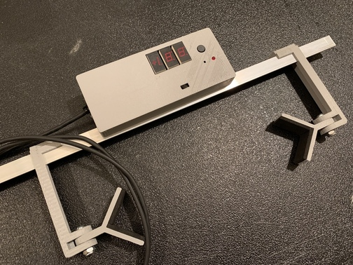

# Incidence meter for RC planes

This project implements an incidence meter to measure airfoil angles on RC planes. The project uses an AVR ATMega328p, a set of seven segment LED modules, and an I2C accelerometer module.  Use to measure absolute of aerodynamic surface and relative angle between them.  Project includes code for AVR, schematic and Gerber files for circuit board, and CAD files for 3D printing of mechanical parts. 

## Using the meter

Assemble the circuit board and print the mechanical parts. Then assemble the meter as depicted here

<pic>

### Calibration 

Calibrate the meter before using for the first time and if using after long storage or changing mechanical parts. Calibration stores the zero angle error offset resulting from mechanical imperfections in the AVR EEPROM. 

1.	Stand the meter on a level surface, preferably one that was leveled with a separate leveling tool
2.	Turn on the meter.
3.	If the meter does not have stored calibration information then the calibration LED will blink continuously. You can still measure angles, but the measurements may not be accurate.
4.	Use a non-metal point tool to push the calibration button and check that the calibration LED turns on, or will stop blinking and stay on. 
5.	When ready, press the hold/zero button to store the calibration data. 
6.	The Calibration LED will turn off and the calibration LED should turn off indicating a valid calibration. 
7.	Calibration can be entered and repeated at any time as required. 

### Using the meter

The meter can be used to measure incidence angles on a plane’s aerodynamic surface (wing, stabilizer/elevator) or the relative angle between surfaces.

#### Surface angle

1.	Place the assembled air-frame on a leveled surface. Pre-level the surface with the meter (zero degree angle) or a different leveling tool. Level the surface in two directions at right angle to each other. 
2.	Clamp the meter to the surface. 
3.	Read the angle on the meter. 
4.	Note that this is the angle of incidence relative to the level surface; ground. 

#### Relative incidence angle

1.	Make sure ailerons and elevator are neutral. 
2.	Follow steps 1 through 3 above on the aircraft’s wing. 
3.	Press the Zero/Hold button 
4.	The display should read zero
5.	Move the meter and clamp to a different surface such as the horizontal stabilizer. 
6.	The reading on the meter now shows the relative incidence angle between horizontal stabilizer and wing. Positive or negative indicates a positive or negative incidence angle.
7.	Compare the measurement to the plans or manufacturer recommendations. 

